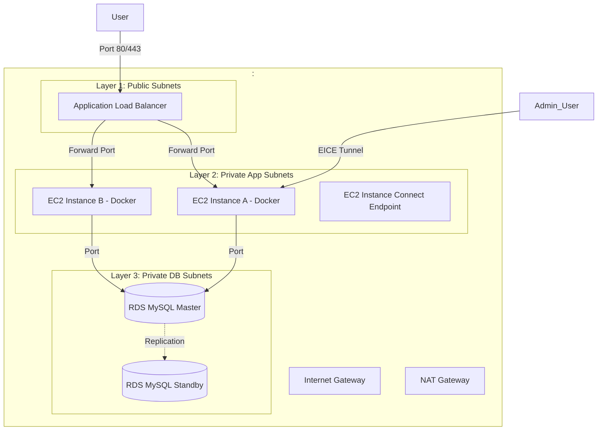

# 📘 HƯỚNG DẪN CHI TIẾT TRIỂN KHAI TOÀN DIỆN TRÊN 1 VPC (STEP-BY-STEP TỪ A - Z)

Để giúp bạn hình dung và thực hành dễ dàng nhất, dưới đây là tài liệu **hướng dẫn cấu hình trực quan từng nút bấm và dòng lệnh** để triển khai hoàn chỉnh hệ thống trên **1 VPC duy nhất**, sử dụng **EC2 chạy Docker** trong **Auto Scaling Group**, giao tiếp với **RDS MySQL Multi-AZ** và **Application Load Balancer (ALB)**.

---



---

## 🛑 BƯỚC 1: KHỞI TẠO VPC & CẤU TRÚC PHÂN KHU (SUBNETS)
Mục tiêu là tạo ra 1 vùng mạng và chia thành **6 Subnets** phân bổ trên **2 Vùng sẵn sàng (Availability Zones - AZ)**.

1. Vào AWS Console ──> Tìm dịch vụ **VPC** ──> Click **Create VPC**.
2. Thiết lập thông số VPC:
   * **Resources to create:** Chọn **VPC and more** (Tự động tạo Route Table, Subnets trực quan).
   * **Name tag auto-generation:** Điền `<VPC_NAME>` (Ví dụ: `production-vpc`).
   * **IPv4 CIDR block:** `<VPC_CIDR>` (Ví dụ: `10.0.0.0/16`).
   * **Number of Availability Zones (AZs):** Chọn `2` (Ví dụ: `<AZ_1>` và `<AZ_2>`).
   * **Number of Public Subnets:** Chọn `2` (Dành cho Load Balancer & NAT Gateway).
   * **Number of Private Subnets:** Chọn `4` (2 Subnet cho App và 2 Subnet cho DB).
3. Tùy chỉnh CIDR của các Subnets cho khoa học (ở mục Customize subnets CIDR blocks):
   * **Public Subnet 1 (AZ 1):** `<PUBLIC_SUBNET_1_CIDR>` (Ví dụ: `10.0.1.0/24`)
   * **Public Subnet 2 (AZ 2):** `<PUBLIC_SUBNET_2_CIDR>` (Ví dụ: `10.0.2.0/24`)
   * **Private App Subnet 1 (AZ 1):** `<PRIVATE_APP_SUBNET_1_CIDR>` (Ví dụ: `10.0.10.0/24` - Đặt EC2 Docker ở đây)
   * **Private App Subnet 2 (AZ 2):** `<PRIVATE_APP_SUBNET_2_CIDR>` (Ví dụ: `10.0.11.0/24` - Đặt EC2 Docker ở đây)
   * **Private DB Subnet 1 (AZ 1):** `<PRIVATE_DB_SUBNET_1_CIDR>` (Ví dụ: `10.0.20.0/24` - Đặt RDS MySQL ở đây)
   * **Private DB Subnet 2 (AZ 2):** `<PRIVATE_DB_SUBNET_2_CIDR>` (Ví dụ: `10.0.21.0/24` - Đặt RDS MySQL ở đây)
4. **NAT Gateways:** Chọn `1 per AZ` (Hoặc `1 in 1 AZ` nếu muốn tiết kiệm chi phí lab).
5. **VPC Endpoints:** Chọn `S3 Gateway` (Miễn phí, tối ưu hóa băng thông truy cập S3).
6. Click **Create VPC** và đợi quá trình thiết lập tự động hoàn tất trong 1 phút.

---

## 🔒 BƯỚC 2: CẤU HÌNH SECURITY GROUPS CHAINING (BẢO MẬT 3 LỚP)
Chúng ta sẽ tạo ra 3 nhóm bảo mật liên kết nối tiếp nhau để đảm bảo không ai có thể xâm nhập trực tiếp vào Server và Database.

Vào VPC Dashboard ──> Tìm **Security Groups** bên thanh sidebar ──> Click **Create Security Group**.

### 1. Nhóm 1: `<SG_ALB_NAME>` (Ví dụ: `sg-alb` - Dành cho Application Load Balancer)
* **Description:** Allow public web traffic to ALB.
* **VPC:** Chọn `<VPC_NAME>`.
* **Inbound Rules (Luật nhận):**
  * Rule 1: Type `HTTP` | Port `80` | Source `Anywhere-IPv4 (0.0.0.0/0)`.
  * Rule 2: Type `HTTPS` | Port `443` | Source `Anywhere-IPv4 (0.0.0.0/0)`.

### 2. Nhóm 2: `<SG_EC2_APP_NAME>` (Ví dụ: `sg-ec2-app` - Dành cho EC2 chạy Docker)
* **Description:** Allow traffic from ALB and secure management.
* **VPC:** Chọn `<VPC_NAME>`.
* **Inbound Rules (Luật nhận):**
  * Rule 1: Type `Custom TCP` | Port `<APP_PORT>` (Ví dụ: `3000` hoặc port ứng dụng của bạn) | Source chọn **Security Group** và tìm tên `<SG_ALB_NAME>`.
    *(Giải thích: Chỉ cho phép request đi xuyên qua ALB mới được chạm vào máy ảo EC2).*

### 3. Nhóm 3: `<SG_RDS_DB_NAME>` (Ví dụ: `sg-rds-db` - Dành cho cơ sở dữ liệu RDS MySQL)
* **Description:** Allow connection from App instances only.
* **VPC:** Chọn `<VPC_NAME>`.
* **Inbound Rules (Luật nhận):**
  * Rule 1: Type `MYSQL/Aurora` | Port `<DB_PORT>` (Ví dụ: `3306`) | Source chọn **Security Group** và tìm tên `<SG_EC2_APP_NAME>`.
    *(Giải thích: Tuyệt đối chặn tất cả kết nối bên ngoài, chỉ cho phép container chạy trên EC2 kết nối vào DB).*

---

## 🛜 BƯỚC 3: TẠO EC2 INSTANCE CONNECT ENDPOINT (EICE)
Vì máy ảo EC2 sẽ nằm trong Private Subnet và không có IP Public, làm sao để SSH vào cài đặt/kiểm tra? Chúng ta sẽ dùng **EC2 Instance Connect Endpoint (EICE)** để SSH an toàn mà không cần mở Port 22 ra internet công cộng.

### 3.1 Cấu hình Security Group cho EICE
Để Endpoint có thể giao tiếp nội bộ trong VPC:
1. Vào **Security Groups** ──> Click **Create Security Group**.
   * **Security group name:** `<SG_EICE_NAME>` (Ví dụ: `sg-eice-endpoint`).
   * **Description:** Group for EICE Connect.
   * **VPC:** Chọn `<VPC_NAME>`.
2. **Outbound Rules (Luật gửi đi):**
   * Rule 1: Type `SSH (22)` | Destination chọn **Custom** và chọn nhóm `<SG_EC2_APP_NAME>` (nhóm bảo mật của EC2).
3. Click **Create security group**.

### 3.2 Cấu hình Security Group của EC2 để nhận kết nối từ EICE
1. Vào **Security Groups** ──> Chọn nhóm `<SG_EC2_APP_NAME>` (nhóm bảo mật đang gán vào các máy EC2).
2. **Edit Inbound Rules (Luật nhận):**
   * Thêm rule: Type **SSH (22)** | Source chọn **Custom** và tìm tên nhóm `<SG_EICE_NAME>` vừa tạo ở bước 3.1.
     *(Giải thích: Chỉ cho phép kết nối đi xuyên qua Endpoint bảo mật này mới được phép SSH vào EC2, chặn hoàn toàn port 22 với thế giới).*
3. Click **Save rules**.

### 3.3 Khởi tạo Endpoint EICE trên AWS
1. Vào VPC Dashboard ──> Tìm **Endpoints** bên sidebar ──> Click **Create Endpoint**.
2. Điền thông tin:
   * **Name:** `<EICE_NAME>` (Ví dụ: `eice-production`).
   * **Service Category:** Chọn **EC2 Instance Connect Endpoint**.
   * **VPC:** Chọn `<VPC_NAME>`.
   * **Security Groups:** Chọn nhóm `<SG_EICE_NAME>` đã tạo ở bước 3.1.
   * **Subnet:** Chọn `<PRIVATE_APP_SUBNET_1_NAME>` (Đặt ở phân khu app).
3. Click **Create Endpoint** (Mất khoảng 1 - 2 phút để chuyển sang trạng thái Active).

### 3.4 Thao tác kết nối từ máy cá nhân (Local PC) của bạn

> [!NOTE]  
> Điều kiện cần: Máy tính của bạn đã cài đặt **AWS CLI** và chạy lệnh `aws configure` để đăng nhập bằng tài khoản IAM có quyền quản lý EC2.

Bạn có 2 cách tuyệt vời để kết nối tùy theo nhu cầu:

#### Cách 1: Kết nối trực tiếp qua AWS CLI (Nhanh nhất - Không cần file key `.pem`)
AWS CLI sẽ tự động sinh Key tạm thời bảo mật để xác thực. Mở Terminal (Git Bash, PowerShell) trên máy tính gõ:
```bash
aws ec2-instance-connect ssh --instance-id <EC2_INSTANCE_ID> --os-user <OS_USER>
```
*(Thay `<EC2_INSTANCE_ID>` bằng ID thật của máy ảo EC2 của bạn và `<OS_USER>` bằng user hệ điều hành, ví dụ: `ubuntu`).*

#### Cách 2: Thiết lập đường hầm SSH Tunnel (Để dùng MobaXterm, VS Code Remote SSH, Termius)
Nếu bạn muốn dùng key `.pem` đã tải và quản lý qua các công cụ bên thứ ba:
1. Mở Terminal thứ nhất dưới máy cá nhân của bạn và chạy lệnh duy trì đường hầm (giữ Terminal này chạy liên tục):
   ```bash
   aws ec2-instance-connect tunnel --instance-id <EC2_INSTANCE_ID> --port 22 --local-port <LOCAL_PORT>
   ```
   *(Ví dụ: `--local-port 50022`)*
2. Mở Terminal mới hoặc phần mềm (MobaXterm/Termius) để kết nối:
   * **Qua Terminal:**
     ```bash
     ssh -i "<YOUR_KEYPAIR>.pem" <OS_USER>@localhost -p <LOCAL_PORT>
     ```
   * **Qua MobaXterm:** Tạo Session **SSH** mới với Host: `localhost` | Port: `<LOCAL_PORT>` | Username: `<OS_USER>` | Tải file `.pem` vào mục Private key.

---

## 💾 BƯỚC 4: TRIỂN KHAI DATABASE RDS MYSQL MULTI-AZ
Cấu hình DB nằm trọn trong DB Subnets và tự động đồng bộ dự phòng.

### 4.1 Tạo DB Subnet Group
1. Vào dịch vụ **RDS** trên AWS Console ──> Tìm **Subnet Groups** ──> Click **Create DB Subnet Group**.
2. Điền tên: `<DB_SUBNET_GROUP_NAME>` (Ví dụ: `db-subnet-group-prod`).
3. VPC: Chọn `<VPC_NAME>`.
4. **Add subnets:**
   * Chọn Availability Zones: `<AZ_1>` và `<AZ_2>`.
   * Chọn Subnet ứng với DB Layer: Tìm subnet `<PRIVATE_DB_SUBNET_1_CIDR>` và `<PRIVATE_DB_SUBNET_2_CIDR>`.
5. Click **Create**.

### 4.2 Tạo Database MySQL
1. Vào RDS Dashboard ──> Chọn **Databases** ──> Click **Create Database**.
2. Cấu hình tạo:
   * **Database creation method:** Chọn **Standard create**.
   * **Engine options:** Chọn **MySQL**.
   * **Templates:** Chọn **Dev/Test** (Hoặc **Production** nếu chạy thực tế, chọn **Free Tier** nếu làm bài lab tiết kiệm).
   * **Settings:**
     * **DB instance identifier:** `<DB_IDENTIFIER>` (Ví dụ: `production-mysqldb`).
     * **Master username:** `<DB_MASTER_USERNAME>` (Ví dụ: `admin`).
     * **Master password:** Điền mật khẩu cực kỳ an toàn của bạn (ví dụ: `<DB_MASTER_PASSWORD>`).
   * **Connectivity:**
     * **Virtual private cloud (VPC):** Chọn `<VPC_NAME>`.
     * **DB Subnet Group:** Chọn `<DB_SUBNET_GROUP_NAME>` vừa tạo ở trên.
     * **Public access:** Chọn **No** (Chặn hoàn toàn từ internet).
     * **VPC Security Group:** Chọn **Choose existing** ──> Xóa group default và tích chọn nhóm `<SG_RDS_DB_NAME>`.
   * **Database port:** `<DB_PORT>` (Ví dụ: `3306`).
   * **Multi-AZ deployment:** Chọn **Create a standby instance** (Tự động tạo 1 bản copy đồng bộ ở AZ 2 để dự phòng thảm họa).
3. Click **Create Database** (Quá trình khởi tạo mất khoảng 5 - 10 phút).
4. Khi DB khởi tạo xong, hãy copy lại **Endpoint** của DB (dạng: `<DB_IDENTIFIER>.<RANDOM_STRING>.<AWS_REGION>.rds.amazonaws.com`).

---

## 🖥️ BƯỚC 5: TẠO LAUNCH TEMPLATE CHO MÁY ẢO EC2 CHẠY DOCKER
Launch Template là khuôn mẫu thiết kế cấu hình phần cứng và phần mềm, giúp Auto Scaling Group tự động tạo ra hàng loạt EC2 giống nhau.

1. Vào dịch vụ **EC2** ──> Chọn **Launch Templates** bên sidebar ──> Click **Create launch template**.
2. Điền thông tin khuôn mẫu:
   * **Launch template name:** `<LAUNCH_TEMPLATE_NAME>` (Ví dụ: `lt-production-app`).
   * **Application and OS Images (AMI):** Chọn **Ubuntu Server 24.04 LTS (x86_64)**.
   * **Instance Type:** Chọn `<INSTANCE_TYPE>` (Ví dụ: `t3.micro` hoặc `t3.medium`).
   * **Key pair:** Chọn key pair SSH của bạn.
   * **Network settings:** 
     * Chọn **Select existing security group** ──> Chọn `<SG_EC2_APP_NAME>`.
    * **Advanced details (Chi tiết nâng cao):**
      * **IAM instance profile:** Giữ nguyên mặc định (Không bắt buộc) do chúng ta sử dụng Docker Hub thay vì Amazon ECR để lưu trữ và tải Image.
      * **User Data:** Dán đoạn script shell tự động hóa hoàn toàn (Unattended Boot Script) dưới đây. Script này sẽ tự động cài đặt Docker, cài đặt các package bổ trợ, tự động cấu hình và tạo file `.env` bảo mật chứa toàn bộ các biến môi trường thực tế cùng file `docker-compose.yml` có sẵn thông số kết nối RDS Database, sau đó tự động đăng nhập Docker Hub bằng Token của bạn để kéo image backend và khởi chạy container ngay khi máy ảo EC2 được khởi tạo bởi Auto Scaling Group:

```bash
#!/bin/bash
# Ngăn chặn script tiếp tục nếu có bất kỳ lệnh nào bị lỗi
set -e

echo "====================================================="
echo "🚀 1. CẬP NHẬT HỆ THỐNG & CÀI CÁC THƯ VIỆN HỖ TRỢ"
echo "====================================================="
apt-get update -y
apt-get install -y apt-transport-https ca-certificates curl software-properties-common gnupg lsb-release unzip

echo "====================================================="
echo "🐳 2. THIẾT LẬP REPOSITORY & CÀI ĐẶT DOCKER"
echo "====================================================="
mkdir -p /etc/apt/keyrings
curl -fsSL https://download.docker.com/linux/ubuntu/gpg | gpg --dearmor -o /etc/apt/keyrings/docker.gpg
echo "deb [arch=$(dpkg --print-architecture) signed-by=/etc/apt/keyrings/docker.gpg] https://download.docker.com/linux/ubuntu $(lsb_release -cs) stable" | tee /etc/apt/sources.list.d/docker.list > /dev/null
apt-get update -y
apt-get install -y docker-ce docker-ce-cli containerd.io docker-buildx-plugin docker-compose-plugin

# Kích hoạt và cho phép Docker chạy cùng hệ thống
systemctl start docker
systemctl enable docker
usermod -aG docker ubuntu

echo "====================================================="
echo "📂 3. TẠO THƯ MỤC ỨNG DỤNG & CẤU HÌNH BIẾN MÔI TRƯỜNG"
echo "====================================================="
mkdir -p /home/ubuntu/app
cd /home/ubuntu/app

# Tạo file cấu hình biến môi trường .env cực kỳ đầy đủ và bảo mật
cat << 'EOF' > .env
# --- APPLICATION SETTINGS ---
PORT=<APP_PORT>
NODE_ENV=<NODE_ENV>

# --- DATABASE CONFIGURATION (RDS MYSQL MULTI-AZ) ---
DB_HOST=<RDS_DB_ENDPOINT>
DB_PORT=<DB_PORT>
DB_USER=<DB_MASTER_USERNAME>
DB_PASS=<DB_MASTER_PASSWORD>
DB_NAME=<DB_NAME>

# --- OTHER CONFIGURATIONS (JWT, SMTP, API keys...) ---
# Bổ sung các biến môi trường đặc thù của dự án tại đây (ví dụ: JWT_SECRET, VNPAY_SECRET, vv.)
EOF

echo "====================================================="
echo "🛠️ 4. TẠO FILE DOCKER COMPOSE"
echo "====================================================="
# Tạo file cấu hình docker-compose.yml hoàn chỉnh
cat << 'EOF' > docker-compose.yml
version: '3.8'

services:
  backend-app:
    image: <DOCKER_HUB_USERNAME>/<DOCKER_REPOSITORY_NAME>:<TAG>
    container_name: <CONTAINER_NAME>
    restart: always
    env_file:
      - .env
    ports:
      - "<HOST_PORT>:<CONTAINER_PORT>"
    volumes:
      - ./uploads:/app/uploads
    networks:
      - app-network

networks:
  app-network:
    driver: bridge
EOF

# Phân quyền sở hữu thư mục ứng dụng cho user mặc định ubuntu
chown -R ubuntu:ubuntu /home/ubuntu/app

echo "====================================================="
echo "🔑 5. KÉO IMAGE MỚI NHẤT & KHỞI CHẠY CONTAINER"
echo "====================================================="
# Kéo image mới nhất từ Docker Hub và chạy container ứng dụng (Không cần login nếu repository là Public)
docker compose pull
docker compose up -d

echo "🎉 [HOÀN TẤT] DỰ ÁN ĐÃ ĐƯỢC KHỞI CHẠY HOÀN TOÀN TỰ ĐỘNG!"
```

> [!IMPORTANT]
> **ĐIỂM CẢI TIẾN VẬN HÀNH & BẢO MẬT:**
> 1. Toàn bộ **biến môi trường thực tế** (bao gồm cả credentials của các dịch vụ bên thứ ba...) đã được đồng bộ hóa và tự động ghi vào file `.env` trên EC2 Server thay vì ghi lộ thông tin trong file `docker-compose.yml`.
> 2. Các thông số kết nối RDS Database được cấu hình trực tiếp giúp ứng dụng giao tiếp an toàn thông qua Security Group.
> 3. Lệnh `docker compose` (Docker Compose V2) được sử dụng thống nhất cho toàn bộ hệ thống.

3. Nhấp chọn **Create launch template** để hoàn tất việc tạo khuôn mẫu.

---

### 5.3 [Tùy Chọn] Hướng dẫn Triển khai Thủ công Trực tiếp trên EC2 VM qua SSH
Nếu bạn muốn cài đặt và cấu hình thủ công từng bước trên máy ảo EC2 thay vì dùng User Data tự động:

#### 1. Tạo Shell Script cài đặt Docker & Docker Compose thủ công
Sau khi kết nối SSH thành công vào máy ảo EC2, thực hiện chuỗi lệnh sau:
```bash
mkdir -p tools/docker
cd tools/docker
nano install-docker.sh
```

#### 2. Nội dung file `install-docker.sh`:
Copy toàn bộ đoạn code script dưới đây và dán vào cửa sổ soạn thảo `nano`:
```bash
#!/bin/bash
set -e

echo "==============================================="
echo "1. Updating system and installing helper packages..."
sudo apt update -y
sudo apt install -y apt-transport-https ca-certificates curl software-properties-common gnupg lsb-release unzip

echo "2. Configuring GPG security key for Docker..."
sudo mkdir -p /etc/apt/keyrings
curl -fsSL https://download.docker.com/linux/ubuntu/gpg | sudo gpg --dearmor -o /etc/apt/keyrings/docker.gpg

echo "3. Configuring official repository..."
echo \
  "deb [arch=$(dpkg --print-architecture) signed-by=/etc/apt/keyrings/docker.gpg] https://download.docker.com/linux/ubuntu \
  $(lsb_release -cs) stable" | sudo tee /etc/apt/sources.list.d/docker.list > /dev/null

echo "4. Installing Docker..."
sudo apt update -y
sudo apt install -y docker-ce docker-ce-cli containerd.io docker-buildx-plugin docker-compose-plugin

echo "5. Enabling Docker service..."
sudo systemctl start docker
sudo systemctl enable docker

echo "6. Configuring permissions for Docker user..."
sudo usermod -aG docker $USER

echo "7. Installing Docker Compose..."
sudo curl -L "https://github.com/docker/compose/releases/latest/download/docker-compose-$(uname -s)-$(uname -m)" -o /usr/local/bin/docker-compose
sudo chmod +x /usr/local/bin/docker-compose

echo "==============================================="
echo "🎉 SUCCESSFULLY INSTALLED DOCKER & DOCKER COMPOSE!"
docker --version
docker-compose --version
echo "==============================================="
```
*(Nhấn `Ctrl + O` -> `Enter` để lưu file, sau đó `Ctrl + X` để thoát `nano`).*

**Cấp quyền và chạy script:**
```bash
chmod +x install-docker.sh
./install-docker.sh

# Kích hoạt nhóm docker để chạy không cần sudo mà không cần restart SSH session
newgrp docker
```

#### 3. Hướng dẫn cấu hình và chạy Docker Compose (Sử dụng Docker Hub & RDS thực tế)
Sau khi chạy thành công script cài đặt Docker, tiếp tục thực hiện các bước sau để thiết lập thư mục làm việc, cấu hình biến môi trường bảo mật qua `.env`, tạo file `docker-compose.yml`, và tiến hành kéo image từ Docker Hub về chạy:

1. **Tạo thư mục ứng dụng và truy cập:**
   ```bash
   mkdir -p /home/ubuntu/app
   cd /home/ubuntu/app
   ```

2. **Cấu hình file môi trường `.env` bảo mật:**
   Để bảo mật thông tin tài khoản và endpoint database RDS, chúng ta sẽ tách biệt các biến môi trường vào file `.env`. Mở trình soạn thảo `nano`:
   ```bash
   nano .env
   ```
   Dán cấu hình sau và thay thế bằng các giá trị thực tế của bạn:
   ```ini
   # --- APPLICATION CONFIGURATION ---
   PORT=<APP_PORT>
   NODE_ENV=<NODE_ENV>

   # --- DATABASE CONFIGURATION (RDS MYSQL MULTI-AZ) ---
   DB_HOST=<RDS_DB_ENDPOINT>
   DB_PORT=<DB_PORT>
   DB_USER=<DB_MASTER_USERNAME>
   DB_PASS=<DB_MASTER_PASSWORD>
   DB_NAME=<DB_NAME>

   # --- OTHER CONFIGURATIONS (JWT, SMTP, API keys...) ---
   # Bổ sung các biến môi trường đặc thù của dự án tại đây (ví dụ: JWT_SECRET, VNPAY_SECRET, vv.)
   ```
   *(Nhấn `Ctrl + O` -> `Enter` để lưu file, sau đó `Ctrl + X` để thoát `nano`).*

3. **Tạo và soạn thảo file cấu hình `docker-compose.yml`:**
   Mở trình soạn thảo `nano`:
   ```bash
   nano docker-compose.yml
   ```
   Copy nội dung cấu hình chuẩn hóa dưới đây và dán vào:
   ```yaml
   version: '3.8'

   services:
     backend-app:
       image: <DOCKER_HUB_USERNAME>/<DOCKER_REPOSITORY_NAME>:<TAG> # 🐳 Kéo image backend trực tiếp từ Docker Hub
       container_name: <CONTAINER_NAME>
       restart: always
       # Tự động đọc toàn bộ biến môi trường từ file .env kế bên
       env_file:
         - .env
       ports:
         - "<HOST_PORT>:<CONTAINER_PORT>"
       volumes:
         # Mount thư mục lưu file upload ra ngoài để tránh mất mát dữ liệu khi container khởi động lại
         - ./uploads:/app/uploads
       networks:
         - app-network

   networks:
     app-network:
       driver: bridge
   ```
   *(Nhấn `Ctrl + O` -> `Enter` để lưu file, sau đó `Ctrl + X` để thoát `nano`).*

4. **[Tùy Chọn/Không Bắt Buộc] Đăng nhập vào Docker Hub trên EC2 Server:**
   *Vì repository của bạn đang ở chế độ Public, bạn có thể hoàn toàn bỏ qua bước đăng nhập này. Chỉ cần thiết lập bước này nếu bạn chuyển repository sang chế độ Private:*
   ```bash
   docker login -u <DOCKER_HUB_USERNAME>
   ```
   *(Nhập mật khẩu hoặc Docker Hub Access Token khi được yêu cầu. Khi thấy thông báo `Login Succeeded` là thành công).*

5. **Tải Image mới nhất và khởi chạy dự án thông qua Docker:**
   Sử dụng lệnh `docker compose` hiện đại để kéo image và chạy ngầm container:
   ```bash
   # Kéo phiên bản mới nhất từ Docker Hub về máy ảo
   docker compose pull

   # Khởi động dịch vụ trong chế độ chạy ngầm (detached mode)
   docker compose up -d
   ```

6. **Kiểm tra trạng thái hoạt động và logs hệ thống:**
   Để kiểm tra xem container đã chạy ổn định và kết nối thành công với RDS Database chưa, sử dụng các lệnh:
   ```bash
   # Xem danh sách container đang chạy
   docker compose ps

   # Theo dõi log thời gian thực của container backend để debug
   docker compose logs -f <SERVICE_NAME>
   ```

> [!IMPORTANT]
> **Điểm cải tiến bảo mật & vận hành:**
> - Việc sử dụng file `.env` giúp phân tách mã nguồn (`docker-compose.yml`) khỏi các dữ liệu nhạy cảm.
> - Lệnh `docker compose` (V2) thay thế hoàn toàn cho `docker-compose` (V1) cũ giúp tối ưu hiệu năng và tính tương thích cao với Ubuntu 24.04 LTS.
> - Image ứng dụng được kéo trực tiếp từ Docker Hub `<DOCKER_HUB_USERNAME>/<DOCKER_REPOSITORY_NAME>:<TAG>`, đảm bảo tính đồng bộ hoàn toàn với quá trình build/push của bạn.

---

## ⚖️ BƯỚC 6: TẠO APPLICATION LOAD BALANCER (ALB)
ALB sẽ đóng vai trò là "người gác cổng", đứng ở Public Subnets đón người dùng và gửi request vào các máy EC2 ở Private Subnets.

### 6.1 Tạo Target Group
1. Vào EC2 Dashboard ──> Tìm **Target Groups** bên sidebar ──> Click **Create Target Group**.
2. Cấu hình Target Group theo bảng thông số sau:

| Trường thông tin | Giá trị thiết lập | Chi tiết cấu hình |
| :--- | :--- | :--- |
| **Target type** | `Instances` | Đăng ký đích đến theo phiên bản máy ảo EC2 |
| **Target group name** | `<TARGET_GROUP_NAME>` | Tên của nhóm đích phục vụ ứng dụng |
| **Protocol & Port** | `HTTP` \| `<CONTAINER_PORT>` | Đúng cổng port máy ảo EC2 đang lắng nghe container |
| **VPC** | `<VPC_NAME>` | Chọn đúng VPC chứa hệ thống |
| **Health check path** | `/api/health` hoặc `/` | Endpoint để kiểm tra trạng thái sống của dự án |

3. Click **Next** và click **Create target group** (Chưa cần đăng ký instance thủ công vì Auto Scaling Group sẽ làm việc đó tự động).

### 6.2 Tạo Application Load Balancer
1. Vào EC2 Dashboard ──> Tìm **Load Balancers** bên sidebar ──> Click **Create Load Balancer** ──> Chọn **Application Load Balancer**.
2. Cấu hình thông số ALB như sau:

| Mục cấu hình | Lựa chọn / Giá trị | Chi tiết & Lưu ý |
| :--- | :--- | :--- |
| **Load balancer name** | `<ALB_NAME>` | Tên định danh của bộ cân bằng tải |
| **Scheme** | `Internet-facing` | Cho phép đón nhận lưu lượng truy cập từ bên ngoài Internet |
| **Network mapping** | • **VPC**: Chọn `<VPC_NAME>` <br>• **Mappings**: Tích chọn AZ1 và AZ2, chọn đúng 2 Subnet thuộc **Public Layer** (`<PUBLIC_SUBNET_1_NAME>` và `<PUBLIC_SUBNET_2_NAME>`) | Bắt buộc chọn chính xác 2 subnet Public để có thể đón nhận traffic |
| **Security Groups** | Chọn nhóm `<SG_ALB_NAME>` (Bỏ chọn group default) | Giới hạn truy cập qua các cổng được cấu hình trong Security Group |
| **Listeners and routing** | • **Protocol**: `HTTP` \| **Port**: `80`<br>• **Default action**: Chọn **Forward to** ──> Tìm Target Group `<TARGET_GROUP_NAME>` | Điều phối toàn bộ request cổng 80 vào Target Group đã tạo ở bước 6.1 |

3. Click **Create load balancer**.
4. Đợi ALB được tạo xong, bạn sẽ nhận được một đường link **DNS Name** công cộng (dạng: `<ALB_NAME>-<RANDOM_STRING>.<AWS_REGION>.elb.amazonaws.com`).

---

## 📈 BƯỚC 7: THIẾT LẬP AUTO SCALING GROUP (ASG)
ASG sẽ tự động sinh ra các máy EC2 từ khuôn mẫu Launch Template, đưa chúng vào Private Subnets, và tự động liên kết (Register targets) chúng vào Load Balancer.

1. Vào EC2 Dashboard ──> Tìm **Auto Scaling Groups** bên sidebar ──> Click **Create Auto Scaling Group**.
2. Thực hiện thiết lập qua các bước cấu hình trực quan dưới đây:

### 📦 Step 1: Choose Launch Template
* 🏷️ **Auto Scaling Group name:** `<ASG_NAME>`
* 📐 **Launch template:** Chọn khuôn mẫu `<LAUNCH_TEMPLATE_NAME>` đã tạo ở Bước 5.
* ➔ *Hành động:* Click **Next**.

### 🗺️ Step 2: Choose Instance Launch Options
* 🌐 **VPC:** Chọn `<VPC_NAME>`.
* 📍 **Availability Zones and subnets:** Tích chọn 2 **Private App Subnets** (`<PRIVATE_APP_SUBNET_1_NAME>` và `<PRIVATE_APP_SUBNET_2_NAME>`).
* ➔ *Hành động:* Click **Next**.

> [!TIP]
> **Giải thích bảo mật:** ASG sẽ chỉ sinh ra các máy ảo EC2 bên trong phân khu bảo mật Private App Subnet này nhằm đảm bảo an toàn tối đa cho mã nguồn của bạn.

### ⚙️ Step 3: Configure Advanced Options
* ⚖️ **Load balancing:** Tích chọn **Attach to an existing load balancer**.
* 🎯 **Choose a target group:** Chọn target group `<TARGET_GROUP_NAME>` vừa tạo ở Bước 6.1.
* 🩺 **Health checks:** Tích chọn **ELB (Elastic Load Balancing)**.
* ➔ *Hành động:* Click **Next**.

> [!TIP]
> **Cơ chế tự động khắc phục (Self-healing):** Lựa chọn này giúp hệ thống tự động phát hiện nếu container ứng dụng bị lỗi. Lúc này Load Balancer sẽ báo cáo để ASG tự động hủy máy ảo lỗi và khởi tạo máy mới thay thế ngay lập tức.

### 📊 Step 4: Configure Group Size and Scaling Policies
* 👥 **Desired capacity:** `<DESIRED_CAPACITY>` (Ví dụ: `2` - Mặc định chạy 2 máy ảo song song để chia tải)
* 📉 **Min capacity:** `<MIN_CAPACITY>` (Ví dụ: `1` - Tối thiểu luôn duy trì ít nhất 1 máy hoạt động)
* 📈 **Max capacity:** `<MAX_CAPACITY>` (Ví dụ: `4` - Cho phép tự động mở rộng tối đa lên 4 máy khi có tải đột biến)
* ⚡ **Scaling policies:** Chọn **Target tracking scaling policy** với các thông số cấu hình:
  * **Metric type:** Chọn **Average CPU utilization**.
  * **Target value:** Điền `<CPU_THRESHOLD_PERCENT>` (Ví dụ: `70` - Tự động kích hoạt thêm máy ảo nếu mức CPU trung bình vượt quá 70%).
* ➔ *Hành động:* Click **Next** ──> Click **Create Auto Scaling Group**.

---

## 🏃 BƯỚC 8: KIỂM TRA HỆ THỐNG VÀ HOÀN TẤT
Khi cấu hình xong, hệ thống sẽ tự động kích hoạt chu trình vận hành khép kín:

### 🔄 Quy trình tự động vận hành
1. **Khởi tạo hạ tầng:** Auto Scaling Group tự động tạo và chạy các EC2 phân phối đều trên 2 Private Subnet.
2. **Bootstrap ứng dụng:** Script **User Data** tự động cài Docker, kéo bản Container backend mới nhất về và khởi chạy ở cổng port `<CONTAINER_PORT>`.
3. **Định tuyến thông suốt:** ALB tự động phát hiện các EC2 khỏe mạnh thông qua Health Check và chuyển sang trạng thái **Healthy (InService)** trong Target Group.

### 🧪 Kiểm tra truy cập thực tế
1. Bạn chỉ cần lấy **DNS Name của ALB** (được cung cấp ở Bước 6.2).
2. Sử dụng trình duyệt web hoặc công cụ Postman và truy cập thử nghiệm:
   ```http
   http://<ALB_DNS_NAME>/
   ```

> [!IMPORTANT]
> 🎉 **Hệ thống đã triển khai hoàn tất!**
> Toàn bộ luồng kết nối và truy xuất dữ liệu từ API sẽ đi xuyên suốt:
> `Người dùng (Internet)` ──> `ALB (Public)` ──> `EC2 Docker (Private)` ──> `RDS MySQL (Private DB)` một cách tối ưu, ổn định và bảo mật tuyệt đối.
