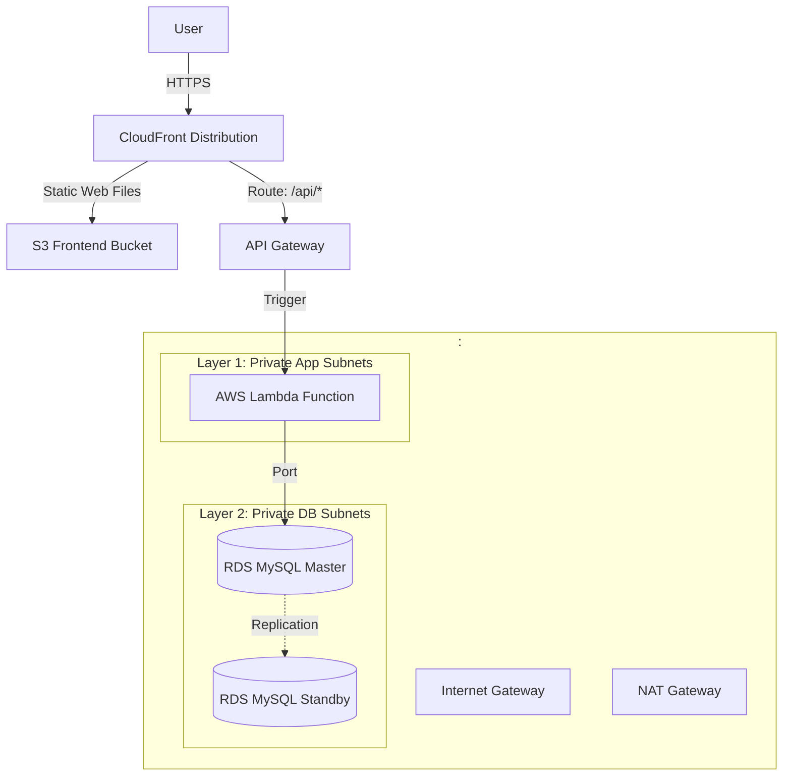

# 📘 HƯỚNG DẪN CHI TIẾT TRIỂN KHAI TOÀN DIỆN TRÊN AWS LAMBDA (STEP-BY-STEP TỪ A - Z)

Tài liệu hướng dẫn từng bước cấu hình trực quan và dòng lệnh để triển khai hoàn chỉnh ứng dụng E-commerce Serverless sử dụng **API Gateway**, **AWS Lambda** (chạy bên trong VPC), **RDS MySQL**, kết hợp **S3** & **CloudFront** cho Frontend.

---



---

## 🔒 BƯỚC 0: PHÂN QUYỀN HỆ THỐNG (IAM)

### 1. Tạo Role `lambdaExecutionRole` (Quyền chạy Lambda)
Role này cấp quyền cho AWS Lambda có thể kết nối vào VPC (để gọi Database), ghi log ra CloudWatch và lấy các key/secret bảo mật từ Secrets Manager.
1. Vào AWS Console ──> Tìm dịch vụ **IAM** ──> Chọn **Roles** ──> Click **Create role**.
2. **Trusted entity type:** Chọn **AWS service**.
3. **Use case:** Chọn **Lambda** từ danh sách thả xuống ──> Click **Next**.
4. **Add quyền:** Tìm và tích chọn các chính sách (policies) sau:
   * `AWSLambdaVPCAccessExecutionRole` (Bắt buộc: Quyền quản lý Network Interface để Lambda kết nối vào VPC).
   * `SecretsManagerReadWrite` (Để đọc credential DB và các token bảo mật).
   * `CloudWatchLogsFullAccess` (Để ghi log phục vụ debug).
5. Click **Next**.
6. **Role name:** Đặt tên là `<LAMBDA_EXECUTION_ROLE_NAME>` (Ví dụ: `lambdaExecutionRole`).
7. Click **Create role**.

---

## 🛜 BƯỚC 1: XÂY DỰNG MẠNG LƯỚI BẢO MẬT (VPC)

Để AWS Lambda kết nối được với Database RDS, cả hai dịch vụ này phải nằm chung một VPC và được phân tách qua các Subnets bảo mật.

### 1. Khởi tạo VPC
1. Vào VPC Dashboard ──> Chọn **VPCs** ──> Click **Create VPC**.
2. Chọn **VPC only** ──> **Name tag:** `<VPC_NAME>` (Ví dụ: `VPC-Lab`).
3. **IPv4 CIDR block:** `<VPC_CIDR>` (Ví dụ: `10.0.0.0/16`) ──> Click **Create**.

### 2. Thiết lập Internet Gateway (IGW) và Public Subnets
1. **Tạo Internet Gateway:** Chọn **Internet gateways** ──> Click **Create** ──> Tên `<IGW_NAME>` (Ví dụ: `IGW-Lab`) ──> Click **Create**.
2. **Attach to VPC:** Chọn `<IGW_NAME>` vừa tạo ──> **Actions** ──> **Attach to VPC** ──> Chọn `<VPC_NAME>`.
3. **Tạo Public Subnets (Dành cho NAT Gateways):**
   * Vào **Subnets** ──> Click **Create subnet** ──> Chọn `<VPC_NAME>`.
   * **Subnet 1:** Tên `<PUBLIC_SUBNET_1_NAME>` (Ví dụ: `Public-Subnet-1`), AZ `<AZ_1>` (Ví dụ: `us-east-1a`), CIDR `<PUBLIC_SUBNET_1_CIDR>` (Ví dụ: `10.0.0.0/24`).
   * **Subnet 2:** Tên `<PUBLIC_SUBNET_2_NAME>` (Ví dụ: `Public-Subnet-2`), AZ `<AZ_2>` (Ví dụ: `us-east-1b`), CIDR `<PUBLIC_SUBNET_2_CIDR>` (Ví dụ: `10.0.1.0/24`).
   * Click **Create**.
4. **Định tuyến cho Public Subnet:**
   * Tạo Route Table tên `<PUBLIC_ROUTE_TABLE_NAME>` (Ví dụ: `Public-Route-Table`) cho `<VPC_NAME>`.
   * Thêm Route: Destination `0.0.0.0/0` ──> Target chọn **Internet Gateway** (`<IGW_NAME>`).
   * Gắn (Associate) Route Table này với cả `<PUBLIC_SUBNET_1_NAME>` và `<PUBLIC_SUBNET_2_NAME>`.

### 3. Tạo NAT Gateways (Cấp Internet cho Lambda)
Để Lambda Function nằm trong Private Subnet có thể gọi ra ngoài Internet (gửi email, gọi API bên thứ ba...), cần có NAT Gateway đặt ở Public Subnet.
1. Chọn **NAT gateways** ──> Click **Create NAT gateway**.
2. **Name:** Gõ `<NAT_GATEWAY_1_NAME>` (Ví dụ: `Nat-Lab-1`).
3. **Subnet:** Chọn `<PUBLIC_SUBNET_1_NAME>`.
4. **Elastic IP:** Click **Allocate Elastic IP** ──> Click **Create**.
5. Tạo NAT Gateway thứ 2 (dự phòng) tên `<NAT_GATEWAY_2_NAME>` đặt tại `<PUBLIC_SUBNET_2_NAME>`.

### 4. Khởi tạo Phân khu Private cho Lambda (Private App Subnets)
1. Chọn **Subnets** ──> Click **Create subnet** ──> Chọn `<VPC_NAME>`.
2. **Subnet 1:** Name `<PRIVATE_APP_SUBNET_1_NAME>` (Ví dụ: `Lambda-Subnet-1`), AZ `<AZ_1>`, CIDR `<PRIVATE_APP_SUBNET_1_CIDR>` (Ví dụ: `10.0.10.0/24`).
3. **Subnet 2:** Name `<PRIVATE_APP_SUBNET_2_NAME>` (Ví dụ: `Lambda-Subnet-2`), AZ `<AZ_2>`, CIDR `<PRIVATE_APP_SUBNET_2_CIDR>` (Ví dụ: `10.0.11.0/24`).
4. Click **Create subnet**.
5. **Cấu hình Route Table cho Lambda Subnets:**
   * Tạo `<APP_ROUTE_TABLE_1_NAME>` ──> Thêm Route `0.0.0.0/0` trỏ về NAT Gateway `<NAT_GATEWAY_1_NAME>` ──> Gắn với `<PRIVATE_APP_SUBNET_1_NAME>`.
   * Tạo `<APP_ROUTE_TABLE_2_NAME>` ──> Thêm Route `0.0.0.0/0` trỏ về NAT Gateway `<NAT_GATEWAY_2_NAME>` ──> Gắn với `<PRIVATE_APP_SUBNET_2_NAME>`.

### 5. Khởi tạo Phân khu Private cho Database (Private DB Subnets)
1. Vào **Subnets** ──> Click **Create subnet** ──> Chọn `<VPC_NAME>`.
2. **DB Subnet 1:** Name `<PRIVATE_DB_SUBNET_1_NAME>` (Ví dụ: `DB-Subnet-1`), AZ `<AZ_1>`, CIDR `<PRIVATE_DB_SUBNET_1_CIDR>` (Ví dụ: `10.0.20.0/24`).
3. **DB Subnet 2:** Name `<PRIVATE_DB_SUBNET_2_NAME>` (Ví dụ: `DB-Subnet-2`), AZ `<AZ_2>`, CIDR `<PRIVATE_DB_SUBNET_2_CIDR>` (Ví dụ: `10.0.21.0/24`).
4. Click **Create subnet**.
5. **Cấu hình Route Table cho DB Subnets:**
   * Tạo Route Table `<DB_ROUTE_TABLE_NAME>` (Ví dụ: `DB-Route-Table`) cho `<VPC_NAME>`.
   * Gắn nó với cả 2 subnet `<PRIVATE_DB_SUBNET_1_NAME>` và `<PRIVATE_DB_SUBNET_2_NAME>`.
   * *Lưu ý:* Không cấu hình bất kỳ đường ra Internet hay NAT nào tại đây.

---

## 🔒 BƯỚC 2: CẤU HÌNH SECURITY GROUPS CHAINING

### 1. Nhóm 1: `<SG_LAMBDA_NAME>` (Tường lửa của AWS Lambda)
1. Vào **Security Groups** ──> Click **Create security group**.
2. **Security group name:** `<SG_LAMBDA_NAME>` (Ví dụ: `Lambda-SG`).
3. **Description:** Security group for AWS Lambda Function.
4. **VPC:** Chọn `<VPC_NAME>`.
5. **Inbound Rules:** Để trống (Lambda không nhận request kết nối trực tiếp vào nó, nó chỉ được kích hoạt thông qua Trigger).
6. **Outbound Rules:** Giữ nguyên mặc định (Allow All) để Lambda có thể gửi request đi.
7. Click **Create**.

### 2. Nhóm 2: `<SG_RDS_DB_NAME>` (Tường lửa của RDS MySQL)
1. Click **Create security group**.
2. **Security group name:** `<SG_RDS_DB_NAME>` (Ví dụ: `DB-SG`).
3. **Description:** Allow connection from Lambda Function only.
4. **VPC:** Chọn `<VPC_NAME>`.
5. **Inbound Rules (Luật nhận):**
   * Type: Chọn `MYSQL/Aurora` (Cổng 3306) | Source: Chọn **Custom**, click tìm và chọn nhóm bảo mật `<SG_LAMBDA_NAME>`.
6. Click **Create security group**.

---

## 💾 BƯỚC 3: TRIỂN KHAI DATABASE RDS MYSQL MULTI-AZ

### 1. Tạo DB Subnet Group
1. Vào dịch vụ **RDS** ──> Chọn **Subnet groups** ──> Click **Create DB subnet group**.
2. **Name:** `<DB_SUBNET_GROUP_NAME>` (Ví dụ: `DB-Subnet-Group`).
3. **VPC:** Chọn `<VPC_NAME>`.
4. **Add subnets:** Chọn AZ `<AZ_1>` và `<AZ_2>`. Tích chọn subnet `<PRIVATE_DB_SUBNET_1_NAME>` và `<PRIVATE_DB_SUBNET_2_NAME>`.
5. Click **Create**.

### 2. Khởi tạo Database MySQL
1. Chọn **Databases** ──> Click **Create database**.
2. Cấu hình thiết lập:
   * **Database creation method:** Chọn **Standard create** ──> Engine: **MySQL**.
   * **Templates:** Chọn **Dev/Test** hoặc **Free Tier** tùy ngân sách.
   * **Settings:**
     * **DB instance identifier:** `<DB_IDENTIFIER>` (Ví dụ: `database-lab`).
     * **Master username:** `<DB_MASTER_USERNAME>` (Ví dụ: `admin`).
     * **Master password:** Nhập mật khẩu bảo mật của bạn.
   * **Connectivity:**
     * **Virtual private cloud (VPC):** Chọn `<VPC_NAME>`.
     * **DB Subnet Group:** Chọn `<DB_SUBNET_GROUP_NAME>`.
     * **Public access:** Chọn **No** (Chặn hoàn toàn kết nối từ Internet).
     * **VPC security group:** Chọn **Choose existing** ──> Xóa default group, chọn nhóm `<SG_RDS_DB_NAME>`.
     * **Availability Zone:** Chọn `<AZ_1>`.
     * **Multi-AZ deployment:** Chọn **Create a standby instance** để tự động đồng bộ dự phòng sang `<AZ_2>`.
3. Click **Create database** và chờ hoàn tất. Copy lại **Endpoint** của DB khi trạng thái chuyển sang `Available`.

---

## ⚡ BƯỚC 4: TRIỂN KHAI MÃ NGUỒN LÊN AWS LAMBDA

Để triển khai mã nguồn (Node.js/Python...) lên AWS Lambda, chúng ta có thể sử dụng 2 cách: file nén `.zip` (truyền thống) hoặc **Container Image** (Docker) khi mã nguồn và các thư viện dependencies vượt quá giới hạn 250MB.

---

### CÁCH 1: SỬ DỤNG FILE NÉN `.zip` (TRUYỀN THỐNG)

#### 1. Đóng gói mã nguồn (Deployment Package)
* Cấu hình backend của bạn để sử dụng các thư viện adapter Serverless (Ví dụ: `serverless-http` hoặc `aws-serverless-express` đối với Express/NestJS) để xử lý các request từ API Gateway.
* Đóng gói toàn bộ mã nguồn cùng thư mục dependencies (`node_modules`) thành 1 file `.zip` (Lưu ý: Đảm bảo file `.zip` được nén ở thư mục gốc chứa file chạy chính).

#### 2. Khởi tạo Lambda Function từ file `.zip`
1. Vào AWS Console ──> Tìm dịch vụ **Lambda** ──> Click **Create function**.
2. Chọn **Author from scratch**.
3. **Function name:** `<LAMBDA_FUNCTION_NAME>` (Ví dụ: `ecom-backend-lambda`).
4. **Runtime:** Chọn môi trường ngôn ngữ tương ứng (Ví dụ: `Node.js 20.x` hoặc `Python 3.11`).
5. **Permissions:** Mở rộng mục *Change default execution role* ──> Chọn **Use an existing role** ──> Chọn `<LAMBDA_EXECUTION_ROLE_NAME>` đã tạo ở Bước 0.
6. **Advanced settings:**
   * Tích chọn **Enable VPC** để gán mạng:
     * **VPC:** Chọn `<VPC_NAME>`.
     * **Subnets:** Chọn 2 private app subnets: `<PRIVATE_APP_SUBNET_1_NAME>` và `<PRIVATE_APP_SUBNET_2_NAME>`.
     * **Security groups:** Chọn nhóm `<SG_LAMBDA_NAME>`.
7. Click **Create function**.
8. **Upload Code:** Tại tab **Code** ──> Tìm mục **Upload from** ở góc phải ──> Chọn **.zip file** và upload file `.zip` của bạn lên (nếu file zip > 50MB, hãy upload lên S3 trước rồi chọn nhập link S3).

---

### CÁCH 2: SỬ DỤNG CONTAINER IMAGE (DOCKER)

Cách này cho phép bạn xây dựng Docker Image của ứng dụng rồi đẩy lên Amazon Elastic Container Registry (ECR). AWS Lambda hỗ trợ kích thước image lên đến 10GB.

#### 1. Viết Dockerfile cho Lambda Function
Tạo file `Dockerfile` ở thư mục gốc dự án sử dụng Base Image được AWS Lambda hỗ trợ:
```dockerfile
# Sử dụng base image AWS Lambda cho Node.js
FROM public.ecr.aws/lambda/nodejs:20

# Copy package.json và package-lock.json
COPY package*.json ./

# Cài đặt dependencies
RUN npm install --only=production

# Copy toàn bộ mã nguồn backend
COPY . .

# Chỉ định file chạy chính và hàm handler (Ví dụ: file index.js chứa handler handler)
CMD [ "index.handler" ]
```

#### 2. Đẩy Docker Image lên Amazon ECR
1. Vào AWS Console ──> Tìm dịch vụ **ECR** (Elastic Container Registry) ──> Click **Create repository**.
2. **Repository name:** `<ECR_REPOSITORY_NAME>` (Ví dụ: `ecom-lambda-repo`) ──> Click **Create**.
3. Click vào repository vừa tạo ──> Chọn **View push commands** ở góc trên bên phải để chạy các lệnh build/tag/push dưới máy cá nhân của bạn:
   * **Đăng nhập ECR CLI:**
     ```bash
     aws ecr get-login-password --region <AWS_REGION> | docker login --username AWS --password-stdin <AWS_ACCOUNT_ID>.dkr.ecr.<AWS_REGION>.amazonaws.com
     ```
   * **Build Docker Image:**
     ```bash
     docker build -t <ECR_REPOSITORY_NAME> .
     ```
   * **Tag Image:**
     ```bash
     docker tag <ECR_REPOSITORY_NAME>:latest <AWS_ACCOUNT_ID>.dkr.ecr.<AWS_REGION>.amazonaws.com/<ECR_REPOSITORY_NAME>:latest
     ```
   * **Push Image lên ECR:**
     ```bash
     docker push <AWS_ACCOUNT_ID>.dkr.ecr.<AWS_REGION>.amazonaws.com/<ECR_REPOSITORY_NAME>:latest
     ```
4. Copy lại đường dẫn URI của image trên ECR (dạng: `<AWS_ACCOUNT_ID>.dkr.ecr.<AWS_REGION>.amazonaws.com/<ECR_REPOSITORY_NAME>:latest`).

#### 3. Khởi tạo Lambda Function từ Container Image
1. Vào dịch vụ **Lambda** ──> Click **Create function**.
2. Chọn mục **Container image**.
3. **Function name:** `<LAMBDA_FUNCTION_NAME>`.
4. **Container image URI:** Click **Browse images** và chọn đúng repository cùng tag image vừa đẩy lên ECR (hoặc dán trực tiếp URI đã copy ở bước trên).
5. **Permissions & VPC Settings:** Cấu hình chọn IAM Role `<LAMBDA_EXECUTION_ROLE_NAME>`, kích hoạt VPC, chọn 2 private app subnets và nhóm bảo mật `<SG_LAMBDA_NAME>` tương tự như Cách 1.
6. Click **Create function**.

---

### CẤU HÌNH CHUNG (ÁP DỤNG CHO CẢ 2 CÁCH)

#### 1. Cấu hình biến môi trường
Chuyển sang tab **Configuration** của Lambda Function ──> Chọn mục **Environment variables** bên sidebar ──> Click **Edit** và dán danh sách biến sau:
```ini
PORT=<APP_PORT>
NODE_ENV=<NODE_ENV>

# --- DATABASE CONFIGURATION (RDS MYSQL MULTI-AZ) ---
DB_HOST=<RDS_DB_ENDPOINT>
DB_PORT=<DB_PORT>
DB_USER=<DB_MASTER_USERNAME>
DB_PASS=<DB_MASTER_PASSWORD>
DB_NAME=<DB_NAME>

# --- OTHER CONFIGURATIONS (JWT, SMTP, API keys...) ---
# Bổ sung các biến môi trường đặc thù của dự án tại đây (ví dụ: JWT_SECRET, VNPAY_SECRET, vv.)
```

#### 2. Điều chỉnh Timeout & RAM cấp phát
1. Chọn mục **General configuration** ──> Click **Edit**.
2. **Memory:** Chọn lượng RAM phù hợp (Ví dụ: `512 MB` hoặc `1024 MB`).
3. **Timeout:** Tăng thời gian tối đa xử lý lên (Ví dụ: `15 seconds` hoặc `30 seconds` để tránh lỗi Gateway Timeout 504 khi Lambda gặp hiện tượng khởi động lạnh - Cold Start).
4. Click **Save**.

---

## 🔀 BƯỚC 5: THIẾT LẬP API GATEWAY (HTTP API)

API Gateway sẽ đóng vai trò là public entry point, đón request từ Internet và chuyển tiếp để kích hoạt (trigger) Lambda Function xử lý.

1. Vào dịch vụ **API Gateway** ──> Chọn **HTTP API** (Tối ưu về chi phí và độ trễ thấp hơn REST API) ──> Click **Build**.
2. **Integrations:** Click **Add integration** ──> Chọn **Lambda**.
   * **Lambda function:** Chọn `<LAMBDA_FUNCTION_NAME>`.
3. **API name:** `<API_GATEWAY_NAME>` (Ví dụ: `ecom-api-gateway`).
4. Click **Next**.
5. **Configure routes:**
   * Để chuyển tiếp toàn bộ request từ Client vào Lambda, chúng ta cấu hình route proxy:
     * **Method:** `ANY`
     * **Resource path:** `/{proxy+}` (Đại diện cho mọi sub-path từ Client gọi lên).
     * **Integration target:** Chọn Lambda `<LAMBDA_FUNCTION_NAME>`.
6. Click **Next** ──> **Define stages:** Giữ nguyên stage `$default` (Tự động deploy khi có thay đổi) ──> Click **Next** ──> Click **Create**.
7. Sau khi tạo xong, copy lại đường link **Invoke URL** của API Gateway (dạng: `https://<API_ID>.execute-api.<AWS_REGION>.amazonaws.com`).

---

## 🌐 BƯỚC 6: TRIỂN KHAI FRONTEND (S3 & CLOUDFRONT)

### 1. Tạo các S3 Buckets
Chúng ta cần tạo 2 Buckets lưu trữ riêng biệt cho Frontend và tài nguyên Media.
1. **S3 Lưu trữ Frontend:**
   * Tạo bucket `<FE_S3_BUCKET_NAME>` (Ví dụ: `frontend-web-ecom-lab`), tắt tùy chọn **Block all public access** để người dùng có thể đọc file.
   * Vào tab **Properties** ──> Bật **Static website hosting** ──> Điền `index.html` cho cả Index và Error document.
   * Vào tab **Permissions** ──> Thêm **Bucket policy** để cho phép đọc file (thay bằng tên bucket thực tế):
```json
{
    "Version": "2012-10-17",
    "Statement": [
        {
            "Sid": "PublicReadGetObject",
            "Effect": "Allow",
            "Principal": "*",
            "Action": "s3:GetObject",
            "Resource": "arn:aws:s3:::<FE_S3_BUCKET_NAME>/*"
        }
    ]
}
```
2. **S3 Lưu trữ Media (Ảnh sản phẩm/User):**
   * Tạo bucket `<MEDIA_S3_BUCKET_NAME>` (Ví dụ: `media-storage-mini-e`).
   * Bật **ACLs enabled** để Backend có quyền cấp phép hiển thị riêng cho từng ảnh sản phẩm khi upload.

### 2. Thiết lập Tường lửa Ứng dụng Web (WAF)
1. Vào dịch vụ **WAF & Shield** ──> Chọn **Web ACLs** ──> Click **Create web ACL**.
2. **Resource type:** Chọn **CloudFront distributions**.
3. **Add rules:** Chọn **Add managed rule groups** của AWS để lọc các traffic bẩn:
   * `Amazon IP Reputation list` (Chặn IP danh tiếng xấu).
   * `Core rule set` (Chặn các lỗ hổng OWASP phổ biến).
   * `SQL database active system` (Chặn tấn công SQL Injection).
4. Hoàn tất các bước tạo.

### 3. Thiết lập CloudFront Distribution (Mạng phân phối nội dung)
1. Vào dịch vụ **CloudFront** ──> Click **Create distribution**.
2. **Origin:**
   * **Origin domain:** Dán link **Bucket website endpoint** từ S3 Frontend (Dạng: `<FE_S3_BUCKET_NAME>.s3-website-<AWS_REGION>.amazonaws.com`).
3. **Web Application Firewall (WAF):**
   * Chọn **Associate web ACL** và chọn đúng Web ACL vừa tạo ở mục 2.
4. **Default cache behavior:**
   * **Viewer protocol policy:** Chọn **Redirect HTTP to HTTPS** để bắt buộc mã hóa toàn bộ dữ liệu.
5. Click **Create distribution** và chờ quá trình phân phối hoàn thành (khoảng 3 - 5 phút). Bạn sẽ nhận được 1 URL phân phối công cộng dạng `https://<CF_ID>.cloudfront.net`.

---

## 🔗 BƯỚC 7: KẾT NỐI FRONTEND & BACKEND (MATCHING FE & BE)

### 1. Phía Backend: Cấu hình CORS
1. Trong cấu hình biến môi trường của Lambda, cập nhật biến **CORS_ORIGINS** trỏ về domain của CloudFront (Ví dụ: `https://<CF_ID>.cloudfront.net`) hoặc tên miền riêng của bạn.
2. *Lưu ý:* Tuyệt đối không để giá trị `*` ở môi trường Production.

### 2. Phía Frontend: Cấu hình API Base URL
1. Tìm file cấu hình môi trường Frontend (Ví dụ: `.env.production` hoặc `src/config.js`).
2. Điền API Base URL trỏ về Invoke URL của API Gateway:
   * `VITE_API_URL` hoặc `REACT_APP_API_URL` = `https://<API_ID>.execute-api.<AWS_REGION>.amazonaws.com`
3. Build mã nguồn Frontend và upload toàn bộ thư mục output (`dist` hoặc `build`) lên S3 Bucket `<FE_S3_BUCKET_NAME>`.

### 3. Phía CloudFront: Ghép nối API về cùng một Domain duy nhất (Tùy chọn)
Để tránh lỗi CORS, bạn có thể cấu hình CloudFront để điều phối cả Frontend tĩnh và Backend API qua cùng một Domain duy nhất:
1. Vào CloudFront Distribution ──> Tab **Origins** ──> Click **Create origin**.
   * **Origin domain:** Dán link domain Invoke URL của API Gateway (Ví dụ: `<API_ID>.execute-api.<AWS_REGION>.amazonaws.com`).
2. Sang tab **Behaviors** ──> Click **Create behavior**.
   * **Path pattern:** Gõ `/api/*`.
   * **Origin:** Chọn API Gateway origin vừa add ở trên.
   * **Viewer protocol policy:** Chọn **Redirect HTTP to HTTPS**.
   * **Cache policy:** Chọn **CachingDisabled** (API không nên cache dữ liệu động).
3. Click **Create behavior**.
4. Giờ đây, Frontend có thể gọi API Backend bằng đường dẫn tương đối (Ví dụ: `/api/v1/...`) thông qua cùng một domain của CloudFront mà không lo phát sinh lỗi CORS.

---

> [!IMPORTANT]
> 🎉 **Hệ thống Serverless đã triển khai hoàn tất!**
> Hệ thống vận hành hoàn toàn theo mô hình Pay-as-you-go (tự động co giãn vô hạn và chỉ trả phí khi có request thực tế):
> `Người dùng (Internet)` ──> `CloudFront (Security/WAF)` ──> `API Gateway` ──> `AWS Lambda (Private Subnets)` ──> `RDS MySQL (Private DB Subnets)` an toàn, bảo mật và hiệu năng cao.
